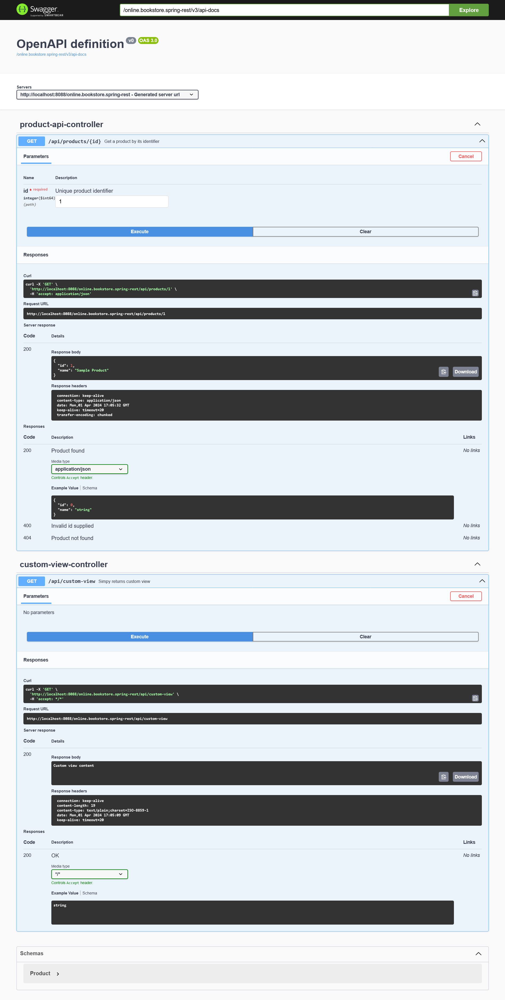

# Developing a RESTful Service With Various Controllers and Handler Mappings

This task is designed to deepen your understanding of Spring MVC's flexibility in handling web requests, the separation of concerns among different types of controllers, and how the DispatcherServlet routes requests in a Spring application.

Duration: 35 minutes

## Description
Create a Spring MVC–based RESTful service that showcases the use of different types of controllers (e.g., @RestController and @Controller with @ResponseBody) and handler mappings.

## Steps

+ Finish the controller edu.epam.fop.presentation.rest.ProductApiController 
+ Finish edu.epam.fop.presentation.rest.ProductApiController  
+ Run the application on the servlet container and try the out API with embedded [swagger-ui](https://github.com/springdoc/springdoc-openapi), e.g.,  http://localhost:8080/online.bookstore.spring-rest/swagger-ui/index.html or a tool like Postman, SOAP UI, etc. 

## Example of result

